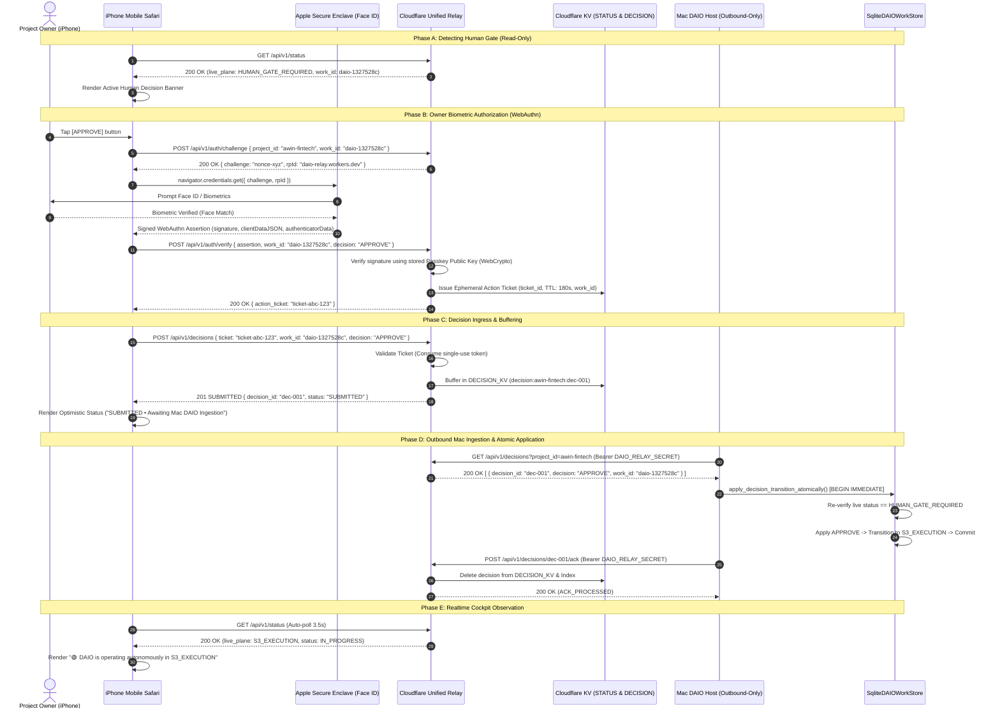

# RPC-3C.1: iPhone Owner Authentication Architecture & Security Specification

**Protocol Phase**: `RPC-3C.1 Owner Authentication Architecture`  
**Target Device**: Apple iPhone (Mobile Safari / iOS WebAuthn / Face ID)  
**Upstream Repository**: `Dual-Agent-Iteration-Orchistration-DAIO-skill`  
**Downstream Consumer**: `_AwinFinTechHybridSystem_`  
**Lifecycle Status**: `RPC-2B.3 = WAITING_FOR_NATURAL_PRODUCTION_HUMAN_GATE`  

---

## 1. Executive Summary & Design Invariants

The goal of **RPC-3C.1** is to design the canonical authentication and session architecture for the iPhone Owner Cockpit before enabling production `APPROVE`, `REVISE`, or `STOP` decision mutations.

### Mandatory Security Invariants:
1. **Zero Permanent Secrets on Client**: The permanent `DAIO_RELAY_SECRET` must **NEVER** be stored in iPhone `localStorage`, `sessionStorage`, client cookies, HTML, JavaScript bundles, Git repositories, or device backups.
2. **Asymmetric Biometric Hardware Authentication (Passkey / WebAuthn)**: The iPhone uses the hardware **Secure Enclave** (Face ID / Touch ID) to generate and hold an asymmetric private key. The Cloudflare Worker stores only the public key in `STATUS_KV` / `AUTH_KV`.
3. **Short-Lived, Work-Scoped Authorization Tickets**: When the Owner approves a Human Gate, an ephemeral, cryptographic authorization ticket (TTL: 180–300 seconds) is issued for the specific `work_id` and `gate_id`.
4. **Zero Inbound Ports on Mac Host**: The Mac host remains strictly outbound-only. Decisions are buffered in Cloudflare `DECISION_KV` and polled by the Mac host over outbound HTTPS.
5. **Fail-Closed Live-State Revalidation**: SQLite `apply_decision_transition_atomically()` inside `BEGIN IMMEDIATE` guarantees that even if a valid decision is transmitted, it will abort with zero mutation if the local work state has evolved.

---

## 2. Current RPC-3B Architecture Audit

| Component | Current Implementation | Security & Boundary Audit |
| :--- | :--- | :--- |
| **`/cockpit`** | Static HTML/CSS/JS served from Worker edge | **Clean**: Read-only, zero embedded secrets, zero decision submit calls. |
| **`/api/v1/status`** | Returns `live_plane` and `durable_plane` from `STATUS_KV` | **Clean**: Public read-only status telemetry. |
| **`/api/v1/health`** | Worker ping & latency check | **Clean**: Public read-only telemetry. |
| **`/api/v1/decisions` (POST)** | Ingress for decision envelopes | **Needs Auth Upgrade**: Currently protected by static `DAIO_RELAY_SECRET` Bearer header. Must accept short-lived Passkey-derived authorization tokens. |
| **`/api/v1/decisions` (GET)** | Polled by Mac host outbound | **Preserved**: Host uses `DAIO_RELAY_SECRET` to fetch pending decisions. |
| **`/api/v1/decisions/:id/ack`** | Acknowledged by Mac host | **Preserved**: Host uses `DAIO_RELAY_SECRET` to delete processed envelopes. |
| **KV Storage** | `STATUS_KV` & `DECISION_KV` | **Preserved**: Ephemeral buffer with TTL. |
| **Mac Host Mutation** | `SqliteDAIOWorkStore.apply_decision_transition_atomically` | **Preserved**: Authoritative `BEGIN IMMEDIATE` compare-and-apply. |

---

## 3. Comparison of Authentication Alternatives

| Evaluation Criteria | Option 1: WebAuthn / Passkey (Face ID Native) | Option 2: Cloudflare Access / Zero Trust (IdP / OTP) | Option 3: Worker-Issued Signed JWT / Password | Option 4: TOTP Authenticator App |
| :--- | :--- | :--- | :--- | :--- |
| **iPhone Safari Usability** | **Exceptional**: 1-tap Face ID prompt directly in Mobile Safari. | Good: Redirects to Cloudflare login portal, then redirects back. | Moderate: Requires typing master passphrase on mobile keyboard. | Moderate: Requires switching between Authenticator app and Safari. |
| **Face ID / Hardware Enclave** | **Yes (Direct)**: Private key hardware-bound in Apple Secure Enclave. | Indirect: WebAuthn can be configured as IdP factor. | No: Software passphrase / secret. | No: Software TOTP seed. |
| **Permanent Secret on iPhone** | **ZERO**: Device stores only private key in Enclave; server stores public key. | **ZERO**: Relies on Cloudflare IdP session cookies. | High Risk: Shared secret must be entered / cached. | High Risk: TOTP seed stored on device. |
| **Token Lifetime** | Ephemeral (Single-action ticket, 180s TTL). | IdP session (Typically 24h+). | Session token (1h – 24h). | 30-second rotating code. |
| **Revocation** | Instant: Delete public key from Cloudflare KV. | Instant: Revoke user in Cloudflare Zero Trust. | Requires rotating signing key. | Requires rotating TOTP secret in KV. |
| **Replay Resistance** | **Absolute**: Cryptographic challenge + sign-counter + nonce. | Good: Session cookie + Cloudflare edge validation. | Moderate: JWT signature check. | Moderate: 30-second replay window. |
| **CSRF / XSS Impact** | **Immune**: WebAuthn requires explicit user gesture + origin binding. | Cookie-based: Requires SameSite + CSRF protection. | Vulnerable if token stored in JS storage. | Vulnerable to automated form submission if unlocked. |
| **Stolen-iPhone Scenario** | **Protected**: Attacker cannot trigger Face ID without Owner's physical presence. | Vulnerable if device is unlocked and session cookie is active. | Vulnerable if browser remembers password. | Vulnerable if phone is unlocked. |
| **Cloudflare Complexity** | **Low**: Native WebCrypto APIs in Cloudflare Worker standard library. | High: Requires Cloudflare Zero Trust account, domain binding, and IdP setup. | Low: Pure Worker code. | Low: Pure Worker code. |
| **Maintenance Burden** | **Zero External Services**: Self-contained in Generic DAIO repo. | High: Requires external IdP & Zero Trust policies. | Low: Minimal code. | Low: Minimal code. |
| **Device Replacement Recovery** | Easy: Register new passkey via Mac admin script (`daio passkey register`). | Handled by external IdP. | Reset master passphrase. | Re-scan QR code. |
| **Outbound-Only Mac Compatibility** | **100% Compatible**: Zero changes to Mac host poller. | 100% Compatible. | 100% Compatible. | 100% Compatible. |

---

## 4. Recommended Canonical Architecture: Native WebAuthn Passkey + Ephemeral Action Ticket

### Why WebAuthn (Passkey / Face ID) is the Canonical Choice:
1. **Zero Permanent Shared Secrets**: The iPhone holds only an asymmetric private key inside its hardware Secure Enclave. Cloudflare holds only the public key.
2. **Native iOS Safari Integration**: No external identity providers, no redirect loops, and zero password typing. Face ID triggers seamlessly via `navigator.credentials.get()`.
3. **Cryptographic Origin Binding**: WebAuthn assertions are cryptographically bound to `daio-relay.huanchen1107.workers.dev`, preventing phishing and man-in-the-middle attacks.
4. **Single-Action Ephemeral Tickets**: An assertion generates a single-use authorization ticket valid for **180 seconds**, explicitly bound to the current `work_id` and `gate_id`.

---

## 5. End-to-End Authentication & Execution Sequence Diagram



---

## 6. Comprehensive Threat Model Matrix

| Threat Scenario | Risk Level | Existing RPC-2 Protection | RPC-3C Passkey / Auth Addition | Net Security Outcome |
| :--- | :---: | :--- | :--- | :--- |
| **1. Stolen / Lost iPhone** | HIGH | None (if secrets were in storage) | **Hardware Biometrics**: Private key cannot be accessed without Owner Face ID. | **BLOCKED**: Attacker cannot sign decisions. |
| **2. Leaked Browser Storage** | HIGH | None (if secrets were in storage) | **Zero Secrets**: No tokens or keys stored in localStorage/sessionStorage. | **BLOCKED**: No secrets to steal. |
| **3. XSS in Cockpit Page** | MEDIUM | Strict Content-Security-Policy | WebAuthn requires explicit physical user gesture (Face ID). Script alone cannot forge signature. | **BLOCKED**: Silent decision submission is impossible. |
| **4. CSRF / Phishing Site** | HIGH | None | WebAuthn assertions cryptographically check `rpId` matching Cloudflare domain. | **BLOCKED**: Foreign domain assertions are rejected. |
| **5. Replayed APPROVE Decision** | HIGH | `decision_id` ledger deduplication in SQLite | WebAuthn challenge nonce + single-use ephemeral ticket. | **BLOCKED**: Replay rejected at both Edge & Mac. |
| **6. Replayed STOP Decision** | HIGH | `decision_id` ledger deduplication in SQLite | Single-use ephemeral ticket expires in 180s. | **BLOCKED**: Replay rejected at Edge and SQLite. |
| **7. Expired Authorization** | MEDIUM | Decision envelope `expires_at` | Ephemeral ticket TTL is strictly 180 seconds. | **BLOCKED**: Expired ticket rejected at Cloudflare Edge. |
| **8. Forged `work_id` / `gate_id`** | HIGH | Fail-closed validation against live SQLite state | Ticket is cryptographically bound to specific `work_id`. | **BLOCKED**: Mutation rejected if work_id mismatches. |
| **9. Stale Human Gate (TOCTOU)** | HIGH | `apply_decision_transition_atomically()` inside `BEGIN IMMEDIATE` | Live state revalidation on Mac host. | **BLOCKED**: Zero mutation committed if gate changed. |
| **10. Concurrent State Change** | HIGH | SQLite atomic compare-and-apply fails closed | Transaction aborts cleanly with error. | **BLOCKED**: No illegal state corruption. |
| **11. Duplicate Button Tap** | LOW | SQLite idempotent ledger | Single-use ticket consumed on first POST; duplicate tap gets 409 Conflict. | **BLOCKED**: Single execution guaranteed. |
| **12. Cloudflare Network Retry** | LOW | Cloudflare idempotent KV keying | KV `put` is idempotent by `decision_id`. | **SAFE**: Zero duplicate envelopes created. |
| **13. Mac Crash Before ACK** | HIGH | Mac re-polls on startup; checks ledger; ACKs without re-applying | Ledger records `decision_id` during transaction. | **SAFE**: Idempotent recovery. |
| **14. Mac Crash After Commit** | HIGH | Next poll checks ledger; detects `APPLIED`; immediately sends ACK | Decision is cleared from queue without second execution. | **SAFE**: Zero double-execution. |

---

## 7. Secrets & Credential Ownership Table

| Credential / Key | Held By | Stored In | Lifetime | Function |
| :--- | :--- | :--- | :--- | :--- |
| **Passkey Private Key** | iPhone Owner | Apple Secure Enclave | Permanent (Per-device) | Signs Face ID authentication challenges. |
| **Passkey Public Key** | Cloudflare Relay | `STATUS_KV` (`auth:passkey:<id>`) | Permanent until revoked | Verifies Face ID signatures using WebCrypto. |
| **Ephemeral Action Ticket** | iPhone Safari Memory | Cloudflare KV (`ticket:<id>`) | **180 Seconds** | Authorizes a single decision POST for an active work item. |
| **`DAIO_RELAY_SECRET`** | Cloudflare & Mac Host | Mac Env / CF Worker Secret | Long-term | Authenticates Mac outbound poller and ACK endpoints. |
| **`DAIO_RPC_PUBLISH_TOKEN`** | Cloudflare & Mac Host | Mac Env / CF Worker Secret | Long-term | Authenticates Mac outbound status publisher. |

---

## 8. iPhone UX Interaction Flow

```
┌────────────────────────────────────────────────────────┐
│ ④ OWNER ACTION                                         │
│ ┌────────────────────────────────────────────────────┐ │
│ │ ⚠️ HUMAN DECISION REQUIRED                          │ │
│ │ Work: smc-orderbook-v1  •  Gate: HUMAN_GATE         │ │
│ │ "Contract review complete. Owner signoff required." │ │
│ │                                                    │ │
│ │  [  ✅ APPROVE (Face ID)  ]   [  🔄 REVISE  ]       │ │
│ │                                                    │ │
│ │  [              🛑 STOP LOOP             ]           │ │
│ └────────────────────────────────────────────────────┘ │
└────────────────────────────────────────────────────────┘
                          │
            Tapping [APPROVE (Face ID)]
                          │
                          ▼
┌────────────────────────────────────────────────────────┐
│ 📱 Apple Face ID System Sheet                          │
│ ┌────────────────────────────────────────────────────┐ │
│ │  Authenticate for DAIO Cockpit                     │ │
│ │  "Approve Work: daio-1327528c"                     │ │
│ │                                                    │ │
│ │               [ 😊 Face ID Icon ]                  │ │
│ └────────────────────────────────────────────────────┘ │
└────────────────────────────────────────────────────────┘
                          │
               Biometric Verification
                          │
                          ▼
┌────────────────────────────────────────────────────────┐
│ ④ OWNER ACTION                                         │
│ ┌────────────────────────────────────────────────────┐ │
│ │ ⏳ DECISION SUBMITTED • Awaiting Mac Ingestion      │ │
│ │ Ticket: tk-89f2 • Decision ID: dec-001 (APPROVE)    │ │
│ │ 🔄 Mac DAIO polling (est. 2s)...                   │ │
│ └────────────────────────────────────────────────────┘ │
└────────────────────────────────────────────────────────┘
```

---

## 9. Proposed Changes & Implementation Plan for RPC-3C.2

When authorized to proceed to **RPC-3C.2 (Passkey Ingress Implementation)**:
1. **Cloudflare Worker Enhancements (`relay_worker.js`)**:
   - Add `POST /api/v1/auth/challenge` (generates cryptographic challenge nonce).
   - Add `POST /api/v1/auth/verify` (verifies WebAuthn assertion with WebCrypto & issues ephemeral ticket).
   - Update `POST /api/v1/decisions` to accept either `Bearer DAIO_RELAY_SECRET` (Mac/CLI) OR `X-Action-Ticket: <ticket_id>` (iPhone Cockpit).
2. **Cockpit Web UI Enhancements**:
   - Embed WebAuthn JavaScript client in `COCKPIT_HTML` using standard `navigator.credentials.get()`.
   - Add Passkey registration management modal for initial device enrollment.
   - Render interactive action buttons (`APPROVE`, `REVISE` modal, `STOP` confirmation) active **only** when `human_gate_required` is true.
3. **Automated Test Suite**:
   - Add WebAuthn challenge/verification unit tests in `tests/test_cockpit_worker.py`.
   - Add ephemeral ticket expiration and single-use enforcement tests.
