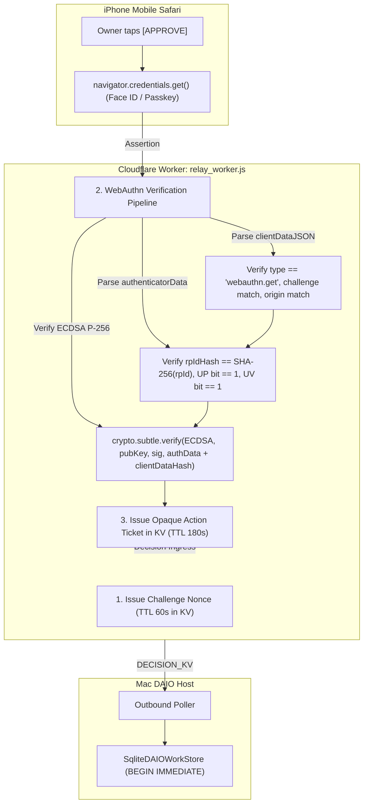

# RPC-3C.1: iPhone Owner Authentication Architecture & Security Hardening Specification

**Protocol Phase**: `RPC-3C.1A Security Hardening & WebAuthn Correctness Review`  
**Target Device**: Apple iPhone (Mobile Safari / WebAuthn / Passkey)  
**Upstream Repository**: `Dual-Agent-Iteration-Orchistration-DAIO-skill`  
**Downstream Consumer**: `_AwinFinTechHybridSystem_`  
**Lifecycle Status**: `RPC-2B.3 = WAITING_FOR_NATURAL_PRODUCTION_HUMAN_GATE`  

---

## 1. Executive Summary & Design Invariants

The goal of **RPC-3C.1A** is to establish the standards-correct, hardened authentication architecture for the iPhone Owner Cockpit before enabling production `APPROVE`, `REVISE`, or `STOP` decision mutations.

### Mandatory Security Invariants:
1. **Zero Permanent Secrets on Client**: The permanent `DAIO_RELAY_SECRET` must **NEVER** be stored in iPhone `localStorage`, `sessionStorage`, cookies, HTML, JavaScript bundles, Git repositories, or logs.
2. **Asymmetric Public-Key Authentication (WebAuthn / Passkey)**: The client signs challenges using a private key (managed by device biometrics / secure storage). Cloudflare stores only the public key in `STATUS_KV` / `AUTH_KV`.
3. **Strictly Bound Action Tickets (Fail-Closed, Single-Use)**: A verified WebAuthn assertion generates an ephemeral, opaque Action Ticket stored in Cloudflare KV (TTL: $\le 180$ seconds). The ticket is strictly bound to: `project_id`, `work_id`, `gate_id`, `current_phase`, `decision`, `action`, `instruction_hash`, `credential_id`, and `expires_at`. An action ticket authorized for `APPROVE` **CANNOT** be reused for `STOP`, `REVISE`, another work item, another gate, or another phase.
4. **Outbound-Only Mac Architecture**: Zero inbound network ports on Mac. Mac daemon polls Cloudflare `DECISION_KV` over outbound HTTPS.
5. **Authoritative Atomic Live-State Revalidation**: SQLite `apply_decision_transition_atomically()` inside `BEGIN IMMEDIATE` guarantees that even if an authenticated decision is received, it will abort with zero mutation if the canonical live state has transitioned.

---

## 2. Standards-Correct WebAuthn Specification (W3C Level 3 via WebCrypto)

Cloudflare Worker natively supports `crypto.subtle` (WebCrypto API), which is fully sufficient to perform standards-correct WebAuthn Level 3 assertion and attestation verification without heavyweight external dependencies.



### 2.1 WebAuthn Verification Pipeline:

1. **Challenge Verification**:
   - Worker generates a 32-byte cryptographically secure random nonce via `crypto.getRandomValues(new Uint8Array(32))`.
   - Challenge is stored in KV (`auth:challenge:<nonce>`) with a strict **60-second TTL** and single-use flag.
   - Client sends base64url-encoded `clientDataJSON`. Worker parses JSON and confirms `parsed.challenge === originalChallenge`. The challenge key is deleted immediately to prevent replay.
2. **Origin & RP ID Verification**:
   - Worker verifies `parsed.origin === "https://daio-relay.huanchen1107.workers.dev"`.
   - Worker computes `SHA-256("daio-relay.huanchen1107.workers.dev")` and confirms it matches the first 32 bytes (`rpIdHash`) of `authenticatorData`.
3. **Authenticator Flags Verification**:
   - Byte 32 of `authenticatorData` contains the flag bitfield:
     - Bit 0 (`UP` - User Present): Must be `1`.
     - Bit 2 (`UV` - User Verified): Must be `1` (enforcing biometric / device PIN verification).
4. **Signature Verification (ECDSA P-256 / ES256)**:
   - Worker extracts the ASN.1 DER signature from `assertion.signature`.
   - Formats signed data: `authenticatorData || SHA-256(rawClientDataJSON)`.
   - Fetches registered public key (stored as JWK or raw SPKI in KV).
   - Verifies signature using `crypto.subtle.verify({ name: "ECDSA", hash: "SHA-256" }, publicKey, signature, signedData)`.
5. **Sign-Count / Replay Check**:
   - `signCount` (bytes 33–36 of `authenticatorData`) is checked against stored `last_sign_count`. If non-zero and `signCount <= last_sign_count`, the assertion is flagged as potential clone/replay and rejected.

---

## 3. Action Ticket Architecture & Schema

### Decision on Ticket Storage:
**Option A (Selected)**: **Opaque Server-Side Single-Use Records in KV**.
- **Rationale**: Storing the ticket as an opaque UUID key in KV with atomic delete-on-read ensures fail-closed single-use semantics without requiring additional asymmetric token signing infrastructure or revocation lists.

### 3.1 Strict Multi-Dimensional Ticket Schema (`ticket:<project_id>:<ticket_id>`):
```json
{
  "ticket_id": "9b1deb4d-3b7d-4bad-9bdd-2b0d7b3dcb6d",
  "project_id": "awin-fintech",
  "work_id": "daio-1327528c",
  "gate_id": "HUMAN_GATE",
  "current_phase": "S3_EXECUTION",
  "decision": "APPROVE",
  "action": "RUN",
  "instruction_hash": "e3b0c44298fc1c149afbf4c8996fb92427ae41e4649b934ca495991b7852b855",
  "credential_id": "cred_apple_enclave_01",
  "issued_at": "2026-09-26T20:45:00Z",
  "expires_at": "2026-09-26T20:48:00Z",
  "consumed": false
}
```

### 3.2 Single-Use Ingestion Boundary:
When `POST /api/v1/decisions` is invoked with `X-Action-Ticket: <ticket_id>`:
1. Worker retrieves ticket from KV: `ticket:<project_id>:<ticket_id>`. If not found or expired $\rightarrow$ `HTTP 401 Unauthorized (FAIL-CLOSED)`.
2. Worker strictly validates that payload fields match ticket bindings:
   - `payload.project_id === ticket.project_id`
   - `payload.work_id === ticket.work_id`
   - `payload.gate_id === ticket.gate_id`
   - `payload.current_phase === ticket.current_phase`
   - `payload.decision === ticket.decision`
   - `payload.action === ticket.action`
3. **Atomic Consumption**: Ticket is **deleted immediately from KV** before buffering into `DECISION_KV`.
4. If validation passes, the decision envelope is buffered in `DECISION_KV` with `delivery_status: "SUBMITTED"`.

---

## 4. Enrollment, Recovery & Credential Lifecycle Architecture

Passkey enrollment is strictly separated from the public read-only cockpit and **cannot be triggered by unauthenticated public web traffic**.

```mermaid
flowchart TD
    subgraph Enrollment_Flow [Passkey Registration & Lifecycle]
        MacAdmin["1. Mac Host: daio passkey enroll"]
        WorkerIssue["2. Worker issues Single-Use Enrollment Token (TTL 10m)"]
        QR["3. Display Secure QR / Enrollment Link to Owner"]
        SafariEnroll["4. iPhone Safari opens link & prompts Face ID registration"]
        StorePub["5. Worker stores Passkey Public Key in KV (auth:passkey:<id>)"]
        
        MacAdmin -->|POST /api/v1/auth/enroll/token (Bearer DAIO_RELAY_SECRET)| WorkerIssue
        WorkerIssue --> QR
        QR --> SafariEnroll
        SafariEnroll -->|POST /api/v1/auth/enroll/verify (attestation)| StorePub
    end
```

### 4.1 Enrollment & Recovery Operations:
1. **Bootstrap / First Device Enrollment**:
   - Initial passkey registration requires the Mac host admin CLI: `python -m daio_closed_loop.tools.passkey_admin enroll`.
   - Mac daemon uses `DAIO_RELAY_SECRET` to request a one-time enrollment token from `POST /api/v1/auth/enroll/token` (TTL: 10 minutes).
   - Owner scans a single-use enrollment QR code or clicks the temporary admin link on iPhone Safari to complete `navigator.credentials.create()`.
2. **Additional Device Enrollment**:
   - Adding a second device (e.g. iPad / secondary phone) requires re-authentication with an existing active Passkey OR a new Mac CLI enrollment token.
3. **Credential Revocation**:
   - Mac admin runs `python -m daio_closed_loop.tools.passkey_admin revoke --cred-id <id>`.
   - Worker immediately deletes `auth:passkey:<credential_id>` from KV.
4. **Lost / Stolen iPhone Recovery**:
   - Mac admin runs `python -m daio_closed_loop.tools.passkey_admin reset-all`.
   - Worker purges all registered credentials and pending action tickets, immediately invalidating the lost device. A new enrollment token is generated for the replacement device.

---

## 5. Browser Surface Hardening & Content Security Policy (CSP)

To eliminate browser injection and XSS attack vectors:
1. **HTTP Response Security Headers**:
   ```http
   Content-Security-Policy: default-src 'self'; script-src 'self' 'unsafe-inline'; style-src 'self' 'unsafe-inline'; connect-src 'self'; frame-ancestors 'none'; object-src 'none'; base-uri 'self'; form-action 'self';
   X-Content-Type-Options: nosniff
   X-Frame-Options: DENY
   Referrer-Policy: strict-origin-when-cross-origin
   Permissions-Policy: publickey-credentials-get=(self), publickey-credentials-create=(self)
   ```
2. **DOM Safety**:
   - Cockpit JavaScript uses `textContent` strictly for all dynamic telemetry values (`project_name`, `work_id`, `human_gate_reason`, etc.). Zero `innerHTML` injection of server or user strings.
3. **Zero Browser Persistence**:
   - No tokens, session cookies, passkey secrets, or relay tokens are written to `localStorage` or `sessionStorage`.

---

## 6. Hardened Threat Model Matrix

| Threat Scenario | Assessment | Defense Mechanism & Mitigation | Residual Risk |
| :--- | :---: | :--- | :--- |
| **1. Stolen / Lost iPhone** | **MITIGATED** | Device biometrics (Face ID / Passkey) required to sign assertions. No plaintext credentials in storage. | Attacker coercing Owner biometrics or obtaining device passcode (mitigated by prompt-time biometric requirement). |
| **2. Leaked Browser Storage** | **MITIGATED** | Zero credentials or tokens stored in browser storage. | None from storage leakage. |
| **3. XSS in Cockpit Page** | **MITIGATED (Defense in Depth)** | Strict CSP + textContent DOM safety + WebAuthn physical user gesture requirement. | Compromised script requesting assertion during legitimate user tap (mitigated by explicit work_id binding in prompt). |
| **4. CSRF / Phishing Site** | **MITIGATED** | WebAuthn browser origin verification cryptographically rejects foreign origins. | Reverse-proxy phishing on spoofed domain (mitigated by WebAuthn rpId binding). |
| **5. Replayed APPROVE / STOP** | **FAIL-CLOSED** | Edge challenge nonce single-use + Action Ticket single-use + SQLite `decision_id` ledger deduplication. | None; replay rejected at Edge and Mac SQLite. |
| **6. Expired Action Ticket** | **FAIL-CLOSED** | Ticket TTL strictly enforced at $\le 180$ seconds. | None. |
| **7. Cross-Action Ticket Reuse (e.g. APPROVE ticket used for STOP)** | **FAIL-CLOSED** | Ticket strictly binds `decision`, `work_id`, `gate_id`, `current_phase`. Mismatch causes immediate 401 rejection. | None. |
| **8. TOCTOU Race / Stale Gate** | **FAIL-CLOSED** | Mac host executes `apply_decision_transition_atomically()` inside `BEGIN IMMEDIATE`. Revalidates live status before commit. | State transition aborted with zero mutation if work item evolved concurrently. |
| **9. Concurrent Mac Daemon Crash** | **DEFENSE IN DEPTH** | SQLite transaction rollback on crash + idempotent decision ledger on recovery. | Zero double-execution or orphaned state. |
| **10. Synced Passkey Exposure (iCloud / Cloud sync)** | **MITIGATED** | End-to-end encrypted passkey sync managed by platform OS; instant revocation supported via Mac admin CLI. | Compromise of Owner Apple ID account (mitigated by Apple multi-factor authentication). |

---

## 7. Implementation Contract for Phase RPC-3C.2

When authorized by Lead Architect, **RPC-3C.2** will implement:
1. **`cloudflare/relay_worker.js`**:
   - WebAuthn verification helper module using `crypto.subtle`.
   - `POST /api/v1/auth/enroll/token` & `POST /api/v1/auth/enroll/verify` (Registration ceremony).
   - `POST /api/v1/auth/challenge` & `POST /api/v1/auth/verify` (Authentication ceremony & Action Ticket issuance).
   - Update `POST /api/v1/decisions` to validate and atomically consume `X-Action-Ticket`.
2. **`COCKPIT_HTML`**:
   - WebAuthn client script handling biometric challenge/assertion.
   - Interactive action sheet (`APPROVE`, `REVISE` modal, `STOP` confirmation) active only upon `HUMAN_GATE_REQUIRED`.
3. **Mac Admin Tool**:
   - `scripts/daio_closed_loop/adapters/passkey_admin.py` for bootstrap enrollment and revocation.
4. **Automated Test Suite**:
   - Unit tests covering challenge expiration, signature validation, ticket field binding enforcement, and single-use consumption.
